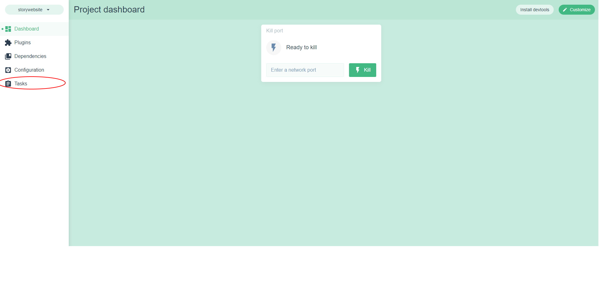

# Installation des outils NPM et Vue Cli

Installer [Node JS](https://nodejs.org/en/) version current.

## Installation des outils

lors de l'installation pensez a cocher la case suivante :


Une fois que tout est intallé rendez-vous dans un powershell ou cmd dans le dossier **storywebsite** du repository

et tapez les commandes suivantes :

```bash
npm i -g yarn @vue/cli
```

```bash
yarn install
```

Après avoir effectué ces commandes tout les outils pour travailler sur le site vue devrais etre installer

## Lancement du projet & importation du projet

lancer un powershell puis executez :

```bash
vue ui
```

Une page internet a du sourvir sur votre pc ressemblant a celle ci-dessous :


appuyez sur **import** verifier quew vous etre bien dans le dossier storywebsite et cliquer sur **import this folder**


Vous serez rediriger vers cet écran :



selectionner tasks puis run tasks une foi sle build compiler vous pouvez ouvrir le site via le bouton open app


Et voila vous avez lancer le site web en dev ! 😀

?> il est aussi possible de passer la partie avec vue ui (apres l'avoir inmporter) en utilisant la commande
**yarn serve** et le projet seras lancé directement
